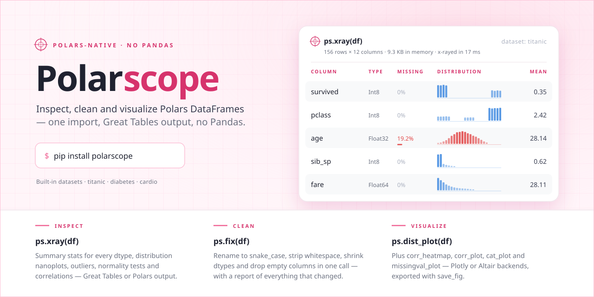
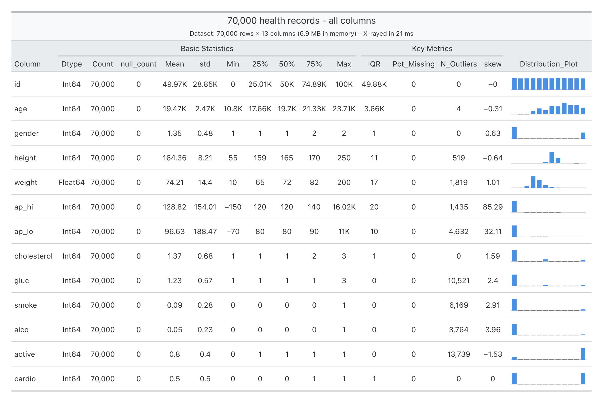
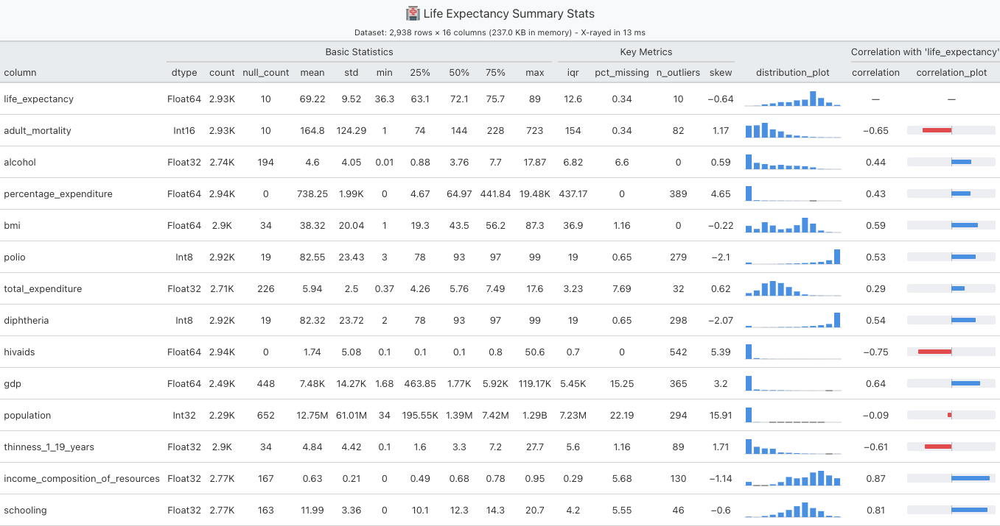

# 🔬 Polarscope - describe() on steroids

**One call, one table: a full profile of any Polars DataFrame. No pandas, anywhere, ever.**

```python
import polars as pl
import polarscope as ps

df = pl.read_csv('your-data.csv')
ps.xray(df)
```



<sub>70,000 rows × 13 columns profiled in 21 ms — every column's dtype, nulls, quartiles, outliers, skew and distribution in a single call.</sub>

[](https://pypi.org/project/polarscope/)
[](https://pypi.org/project/polarscope/)
[](LICENSE)
[](https://pepy.tech/projects/polarscope)

**Simple data inspection tools for Polars** 🐻‍❄️

Polarscope is a basic data analysis library for Polars DataFrames. It provides an `xray()` function for data inspection and some plotting utilities. Still early in development with more features planned.

---

## ✨ Current Features

### 🔬 Dataframe Summary Statistics (`xray`)
- Summary statistics for numeric columns by default; `include='all'` covers every dtype.
- Statistics for String/Categorical/Enum columns: top value and frequency, min/median/avg/max length, mode share, top-3 values, and value samples.
- Boolean columns analyzed as 0/1 (Mean = share of True); temporal columns report earliest/latest timestamps.
- Distribution nanoplot per column.
- Optional title for summary table (`title=Your Title`).
- Optional correlation (`corr_target=column_name`) against target for every column with nanoplot visualization.
- Optional expanded output (`expanded=True`) with normality/uniformity tests, outlier metrics and modelling usability flags.
- Optional compact mode (`compact=True`) that shortens big numbers to K (thousands) and M (millions) and decimal precision (`decimals=int`)
- Great Tables output by default or plain Polars DataFrame output (`great_tables=False`).

Quickly compute the correlation (Spearman or Pearson) to a target column:



### 🧹 Cleaning & Optimization (`fix`)
- `ps.fix(df)` cleans and optimizes in one call: column renaming (`case="snake"/"camel"/"pascal"/"kebab"/"upper"/"lower"`), whitespace stripping (empty strings → null), dtype shrinking, and empty-column removal — with a compact report of what changed.
- Opt-in extras: `drop_duplicate_rows`, `missing_threshold`, `drop_constant_columns`, `outliers="iqr"/"zscore"`.
- Lossless by default: anything that removes or alters data must be switched on explicitly.
- Building blocks also available standalone: `clean_column_names`, `convert_datatypes`, `drop_missing`.

### 📈 Plots
- Correlation/missing/distribution/categorical plots (plotly or altair backends)

### 📊 Built-in Datasets
- Three datasets ship with the package: `ps.titanic()`, `ps.diabetes()`, and `ps.cardio()`.
- Also available via `from polarscope.datasets import titanic, diabetes, cardio`, with loader functions.

### ✅ Polars-Only Data Handling
- Data handling is implemented with Polars.
- No Pandas, anywhere, ever. 

---

## 🔍 How Polarscope compares

| | **polarscope** 1.9.5 | skimpy 0.0.21 | ydata-profiling 4.18.4 | klib 1.4.1 |
|---|---|---|---|---|
| Takes a Polars DataFrame directly | ✅ | ✅ | ❌ convert to pandas first | ❌ convert to pandas first |
| Requires/converts to pandas | **✅ never** | ❌ hard dependency | ❌ | ❌ |
| Core dependencies | **3** | 12 | 21 | 8 |
| Minimum Python | **3.9** | 3.11 | 3.10 | 3.10 |
| Primary output | Great Tables HTML, or Polars DataFrame | terminal (rich) | standalone HTML report | matplotlib/seaborn figures |
| String / categorical stats | ✅ | ✅ | ✅ | partial |
| One-call cleaning and dtype optimization | ✅ `ps.fix()` | ❌ | ❌ | ✅ |

**Where the others are the better choice:**

- **ydata-profiling** produces a far deeper report in one call — variable interactions, correlation matrices, alerts and warnings. If you want an exhaustive standalone HTML artifact and don't mind the 21 dependencies or the pandas conversion, it does more than polarscope does.
- **skimpy** also reads Polars natively and prints straight to the terminal, which is the nicer fit for CLI and script workflows. Polarscope targets notebooks with presentation ready outputs.
- **klib** has a mature pandas cleaning and plotting suite. Polarscope's plotting API is openly modelled on it.

**Where polarscope wins:** it is the only one of the four with **no pandas anywhere in its dependency tree**, and the only one installable on Python 3.9 — which matters if your environment is locked down and you cannot pull in pandas, seaborn and numba just to look at a table.

<sub>Verified 2026-08-10 against each project's published PyPI metadata (`requires_dist`, `requires_python`) at the versions listed. Dependency counts exclude optional extras. Corrections welcome — please open an issue.</sub>

---

## 🚀 Quick Start

### Installation

```bash
pip install polarscope
```

Optional extras:

```bash
pip install "polarscope[altair]"   # optional Altair plotting backend
pip install "polarscope[plotly]"   # Kaleido support for static Plotly images
pip install "polarscope[scipy]"    # statistical tests
pip install "polarscope[all]"      # all optional features
pip install "polarscope[dev]"      # pytest + coverage tools
```

Plotly is included in the base installation and is the default plotting backend.

### Basic Usage

```python
import polars as pl
import polarscope as ps

# Use a built-in dataset or load your own
df = ps.titanic()          # also: ps.diabetes(), ps.cardio()
# df = pl.read_csv("your_data.csv")

# Get basic data summary (all column types)
ps.xray(df, include="all")

# More detailed analysis
ps.xray(df, include="all", expanded=True)

# Custom title and correlation analysis
ps.xray(df, title="My Data Analysis", corr_target="Survived")

# Clean & optimize in one call (snake_case names, trimmed strings,
# shrunk dtypes, empty columns dropped - with a report)
df = ps.fix(df)

# Or opt in to deeper cleaning
df = ps.fix(df, case="camel", drop_duplicate_rows=True, missing_threshold=0.9)
```

### Common `xray()` Options

```python
ps.xray(
    df,
    include="all",                # include all columns (not only numeric)
    expanded=True,                # additional stats/tests/quality fields
    corr_target="column_name",    # correlation against target column
    outlier_method="iqr",         # or "percentile"/"zscore"
    percentiles=[0.1, 0.5, 0.9],  # custom percentiles
    decimals=2,
    great_tables=False            # return Polars DataFrame
)
```

---

## 🤝 Contributing

Contributions are welcome! Feel free to report bugs or suggest improvements.

---

## 📄 License

MIT License - see [LICENSE](LICENSE) file for details.

---

## 🙏 Acknowledgments

Inspired by [`klib`](https://github.com/akanz1/klib) and built with [`Polars`](https://github.com/pola-rs/polars) and [`great_tables`](https://github.com/posit-dev/great-tables).

---

**🔬 A quick and lightweight tool for Polars dataframe stats and visualizations.**
